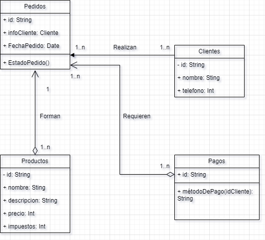

# Programa de gestión de pedidos

---
###### Por ➡ Natalia Cortés Bernal

---

Este progrma proviene de un diagrama UML que se ha realizado
previamente: 

## Información del programa:
Este programa está creado debido a una actividad de la 
asignatura de Entornos de desarrollo, tiene el fin 
educacional únicamente.

Ésta gestiona pedidos teniendo en cuenta productos, y clientes,
así como una confirmación de pago a través de la consola, todos
los datos que se usan en este programa son simulados, no son
reales simplemente se ha rellanado con información para que el
programa funcione debidamente.

